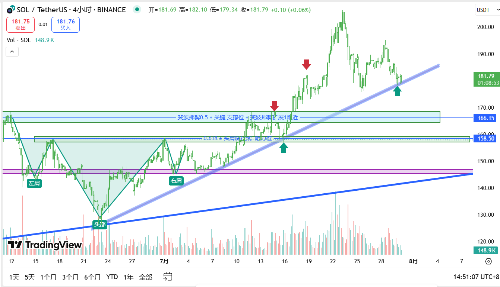
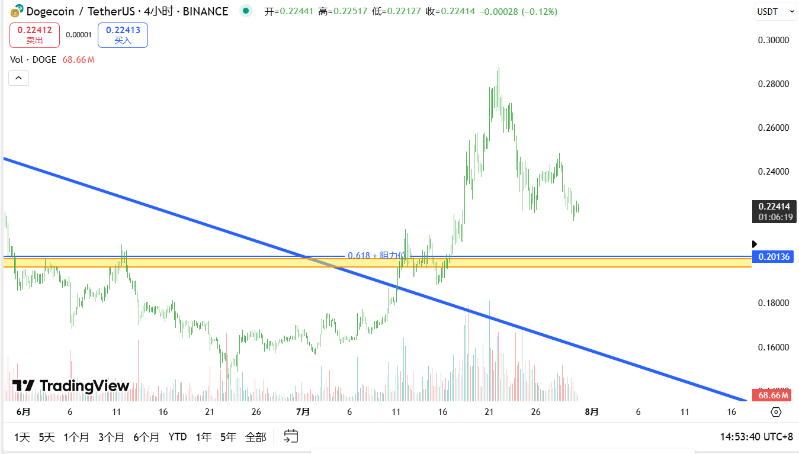
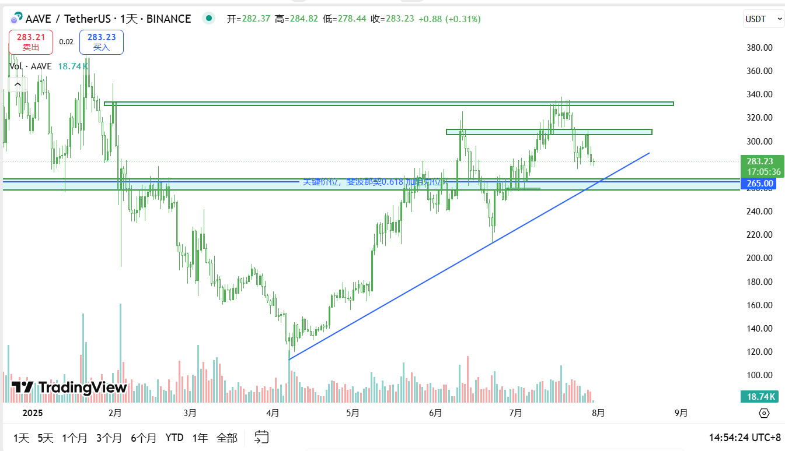

# TradeNotes

> 每日交易笔记 · 交易思路 · 市场分析 · 回顾与复盘

---

## 📅 2025-07-30 交易笔记

### 🎯 交易目标与计划

- 持续关注 **SOL、DOGE、AAVE** 的关键支撑位，逢支撑短线做多。
- **BTC、ETH** 当前处于高位横盘阶段，整体思路为：
  - 支撑位做多、压力位做空；
  - 一旦出现突破或跌破，需及时止损，避免被动。

---

### 🧠 当日思路与逻辑

- **SOL**
  
  - 昨晚已在 178 开多，理由是上升趋势线叠加斐波那契 0.382 附近支撑，当前价格 181，处于盈利状态，止损位设在 173。
  
  - 后续关注两个潜在操作区间：
    - 166 附近：斐波那契 0.5 位置 + 支撑区域；
  - 158 附近：斐波那契 0.168 + 前期头肩底颈线。
    
  - 若回踩上述区域并出现止跌信号，将考虑介入。
  
    
  
- **DOGE**
  
  - 关键支撑位在 0.2 附近，与斐波那契 0.168 重合。

  - 若回踩并企稳，有短多机会，计划持续跟踪。
  
    
  
- **AAVE**
  - 关注 163 附近，该区域为斐波那契 0.618 + 支撑叠加区域。
  
- 若出现止跌结构信号，将考虑做多。
  
    
  
- **BTC + ETH**
  - 高位横盘震荡持续中。
  - 操作策略继续以区间交易为主：
    - 支撑不破可做多，压力不过可做空；
    - 若关键区间出现有效突破或跌破，需第一时间止损调整仓位。

---