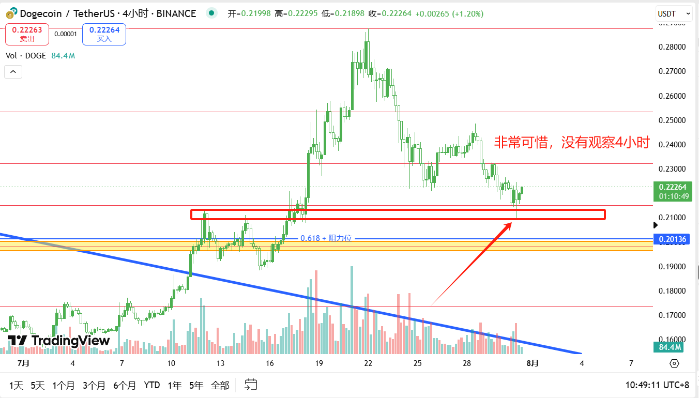

# TradeNotes

> 每日交易笔记 · 交易思路 · 市场分析 · 回顾与复盘

## 📅 2025-07-31 交易笔记

### 🎯 交易目标与计划

- 等待 **DOGE** 回踩关键支撑后的短多机会，尤其关注 0.2 附近能否形成结构。
- **SOL** 多单已止损，暂时观望，关注二次回踩的信号。
- 继续持仓观察 **AAVE** 多单，寻找减仓/加仓的节奏点。
- **BTC、ETH** 高位震荡未变，区间策略继续执行，优先等待关键位反应。

------

### 🧠 当日思路与逻辑

- **SOL**
  - 昨晚在 178 开多，但美联储利率决议公布后行情剧烈波动，短线下扎触发止损（173），随后价格快速拉回，典型“扎针回收”。
  
  - 虽然止损策略执行得当，但结果令人遗憾，反思：是否可以在消息面公布期间减仓或规避波动。
  
  - 后续关注二次回踩的可能，重点区域依旧是 166 和 158，等待结构信号出现。
  
    
- **AAVE**
  
  - 昨日挂单 263 附近接多成功，扎针精确打到，当前已进入盈利区域。
  
  - 此单弥补了 SOL 的亏损，策略执行良好。
  
  - 接下来考虑是否分批止盈，或在支撑未破情况下持有观察更大空间。
  
    
- **DOGE**
  
  - 昨天已回踩到 0.2 上方关键区域，但当时基于日线判断未及时查看 4H 结构，导致错过短多机会。
  
  - 四小时斐波那契结构明显，若能及时关注，可能已有入场点。
  
  - 目前等待下一次回踩，若能形成止跌结构，仍考虑介入。
  
    
- **BTC、ETH**
  - 高位盘整继续，暂时无明显突破方向。
  - 操作策略维持不变：
    - 支撑不破可轻仓做多；
    
    - 压力不过尝试短空；
    
    - 一旦突破需快速止损并调整思路。
    
      
      

------

### 📌 复盘反思

- SOL 的止损令人懊恼，但严格执行纪律是交易长久之道，尤其面对消息面影响时更应控制风险。
- AAVE 的精准进场给予正向反馈，证明技术位仍具有效性。
- DOGE 的错过提醒自己：**“跨周期联动”不可忽视，关键点位应结合多周期判断。**
- 总体小亏但心态稳定，市场不会总是与你作对，**活着就是胜利**，继续等待高胜率机会。