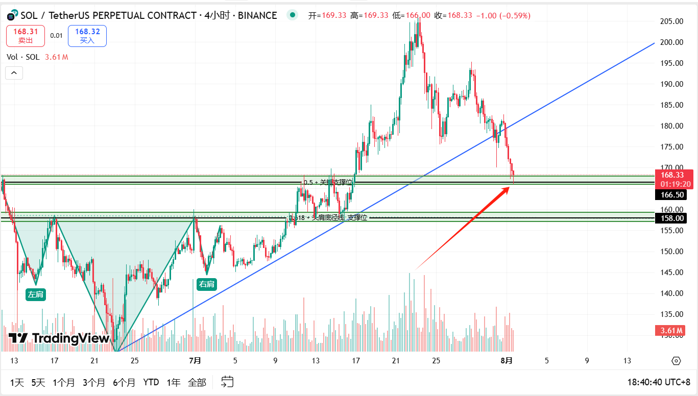
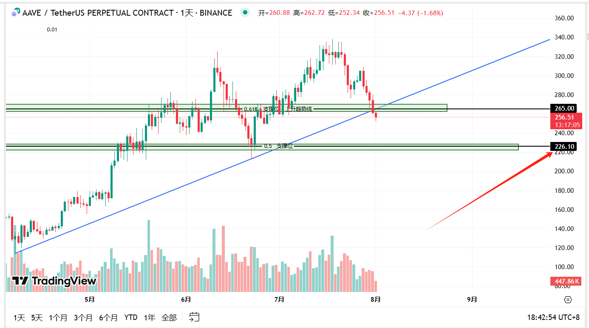
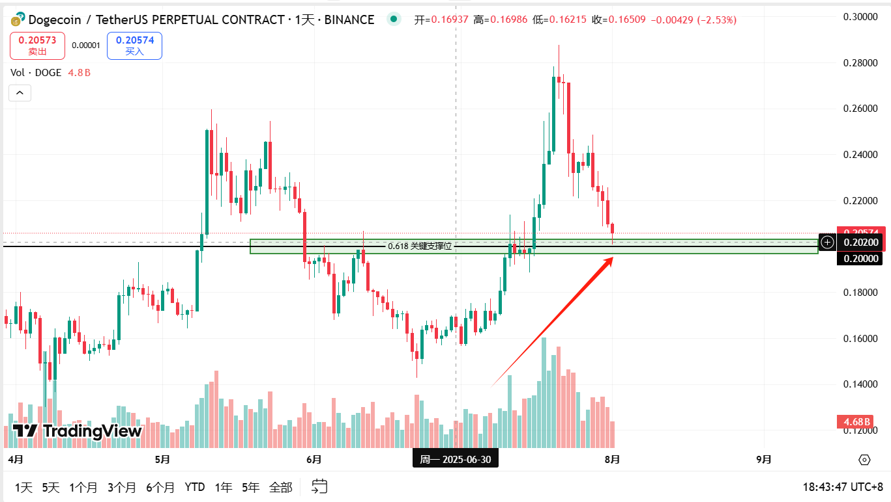

# TradeNotes

> 每日交易笔记 · 交易思路 · 市场分析 · 回顾与复盘

## 📅 2025-08-01 交易笔记

### 🎯 交易目标与计划

- **SOL** 已在 166 精准插针后启动，当前短多持有中，关注结构是否延续。

  

- **AAVE** 触发移动止盈，暂时空仓观望，等待下一次结构进场机会    226附近可以关注一波 短多机会

  

- **DOGE** 回踩关键位2.0已入场短多(可查看昨天文档的图片)，继续观察。

  

  

  **BTC**   **ETH**  看不明白 (继续观望)