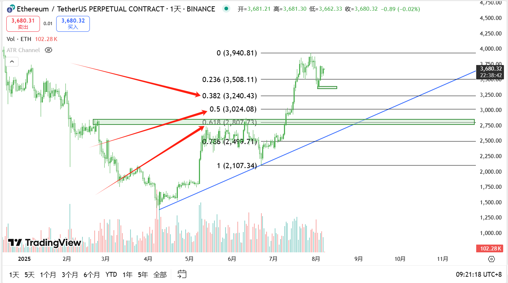
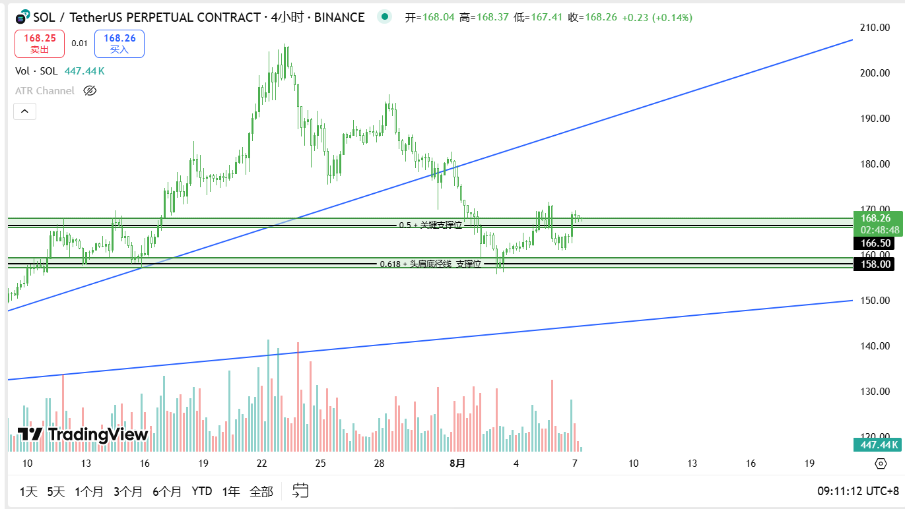
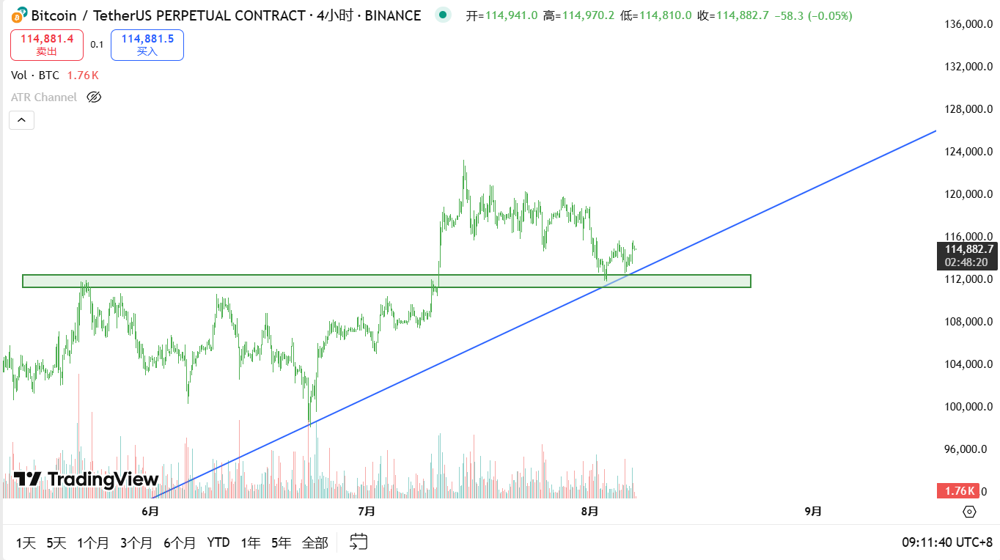
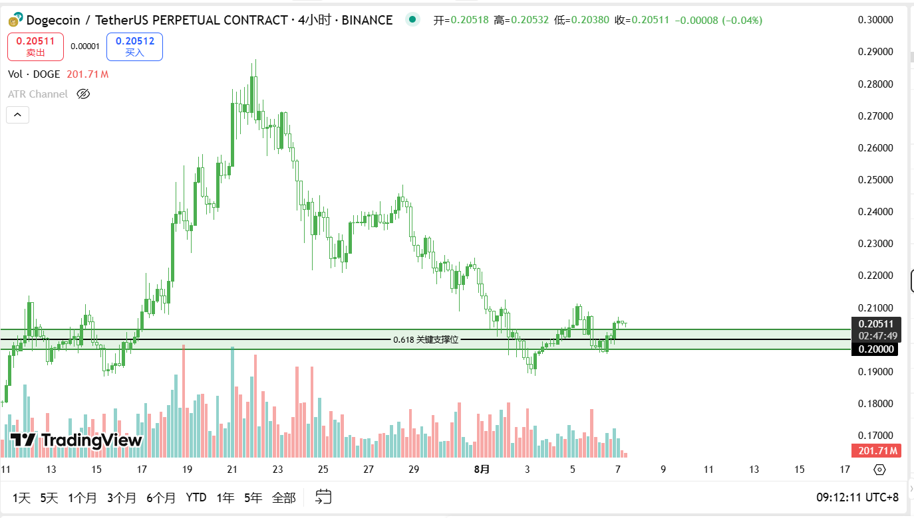
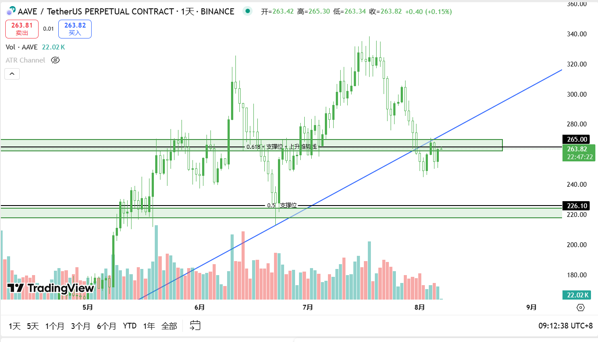

# TradeNotes

> 每日交易笔记 · 交易思路 · 市场分析 · 回顾与复盘

## 📅 2025-08-07 交易笔记

### 🎯 交易目标与计划

- **复盘说明**
   前面几天因为工作原因有点忙，没有进行复盘写笔记。

- 大趋势还是多头

- ETH目前继续观察，等待关键支撑点位：**3250 / 3050/ 2800** 附近，如果价格回踩这些区域并出现信号(需要耐心可能到九月)，再考虑短多介入。整体趋势仍然偏多，目前这波下跌更多看作是回调。

  

------

- **SOL**
   158 这个支撑位测试是到了，目前价格在 168 附近

  

------

- **BTC**
   大饼也是扎到了之前的历史最高位置，这里是接到的也是赚钱的

  

------

- **DOGE**
   DOGE     0.2附近点位跌得有点多，挂单入场可能被扫止损

  

------

- **AAVE**
   继续关注 226 这个点位，等 4小时/1小时出现入场信号再考虑介入，大概率会有插针动作，耐心等机会。

  